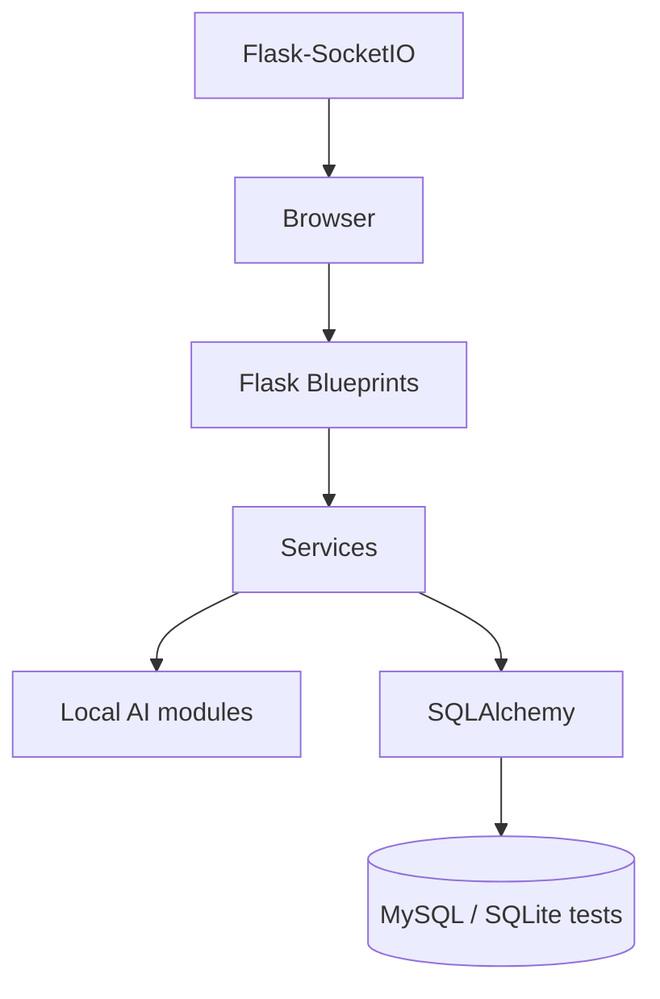

# SmartHire AI Architecture

SmartHire is a Flask monolith with authenticated role-based blueprints, SQLAlchemy models, local AI services, and Flask-SocketIO.

Recruiter ownership is enforced in route queries. Admin analytics aggregate system data. Candidate routes resolve the logged-in candidate from the session rather than trusting client IDs.
