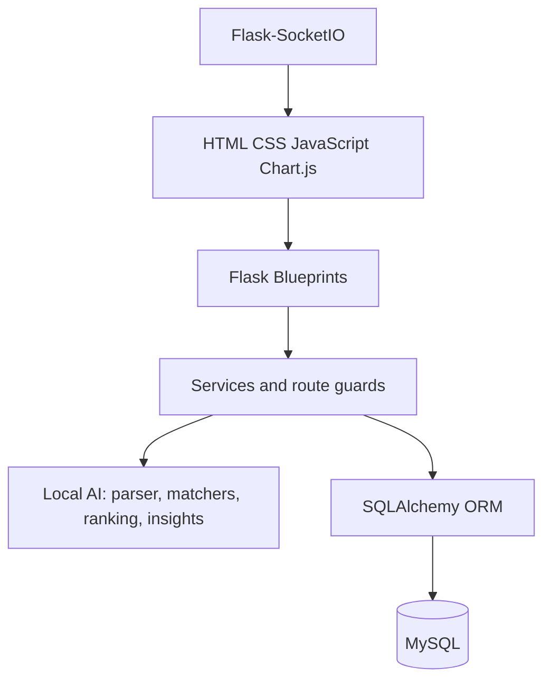

# SmartHire AI Project Architecture

## Layers

Authentication is handled by Flask-Login and role checks by `role_required`. Recruiters own jobs and their related applications/interviews. Candidates resolve their own profile from the authenticated user. Admin analytics aggregate platform records.

The data flow is: uploaded resume or job description -> validated local file -> extracted text -> rule-based parsing and skill extraction -> stored structured data -> matching and weighted score -> ranking/explanation -> analytics, notifications, and Copilot queries.
